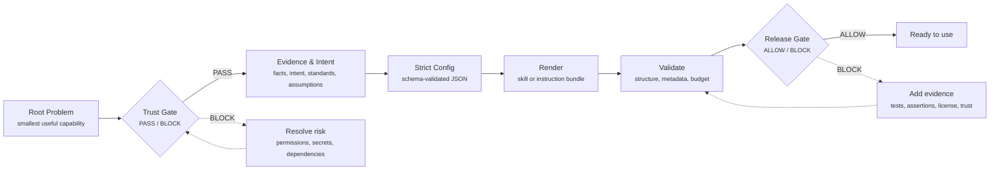

<div align="center">

# 🧠 AI Skill Maker

**ラフな意図、リポジトリの証拠、反復ワークフローから、信頼できる AI skill を作る。**

[](LICENSE)
[](#-クイックスタート)
[](#-codex-skill-としてインストール)
[](#-検証とリリース)

[English](README.md)

</div>

---

AI Skill Maker は、再利用可能な AI skill と assistant instruction bundle
を設計、レンダリング、検証、refresh するための meta-skill です。

ラフな意図、反復可能な workflow、または既存の repository から、evidence
labels、validation scripts、release gates、refresh-safe な user rule blocks
を備えた構造化 skill folder を生成します。

```bash
node scripts/self-check.mjs
node scripts/install-local-skill.mjs --dry-run
```

---

## 📖 目次

| # | セクション | 内容 |
| --- | --- | --- |
| 1 | [存在理由](#-存在理由) | この project が解決する問題 |
| 2 | [作成できるもの](#-作成できるもの) | 対応する skill と adapter output |
| 3 | [クイックスタート](#-クイックスタート) | 検証とレンダリングの copy-paste commands |
| 4 | [ワークフロー](#-ワークフロー) | skill generation pipeline |
| 5 | [生成される構成](#-生成される構成) | rendered skill の中身 |
| 6 | [コマンドリファレンス](#-コマンドリファレンス) | script ごとの使い方 |
| 7 | [検証とリリース](#-検証とリリース) | ship 前に必要な checks |
| 8 | [安全モデル](#-安全モデル) | Trust Gate と protected principles |

---

## ✨ 存在理由

再利用可能な AI skill は、draft するだけなら簡単ですが、信頼できる状態で
保ち続けるのは難しいものです。良い skill には、狭く正確な trigger、
明確な boundaries、実行できる workflow、検証可能な output、そして future
agents が maintainer intent を消さずに refresh できる構造が必要です。

AI Skill Maker はその構造を提供します。Agent が root problem を定め、
evidence を集め、適切な output mode を選び、strict config から skill を
render し、ready と言う前に結果を verify できるようにします。

> 目的は長い prompt を作ることではありません。再利用でき、テストでき、
> refresh でき、信頼できる、小さく鋭い capability を作ることです。

---

## 🧩 作成できるもの

| Output | 向いている用途 | Primary Renderer |
| --- | --- | --- |
| 🛠️ Functional skill | reports、PDF、spreadsheets、API tasks、browser workflows、data processing | `scripts/render-skill.mjs` |
| 📄 Document/template skill | artifact structure、style、reusable assets、rendered fidelity | `scripts/render-skill.mjs` |
| 🔁 Workflow automation skill | tools、CLIs、APIs、scripts による反復手順 | `scripts/render-skill.mjs` |
| 🧭 Project maintainer skill | 特定 repository の長期的な AI maintainer guidance | `scripts/render-project-skill.mjs` |
| 🔌 Adapter instruction bundle | `AGENTS.md`、`CLAUDE.md`、Cursor rules、Copilot instructions | `scripts/render-adapter.mjs` |

### 🏛️ Design Pillars

| Pillar | 意味 |
| --- | --- |
| 🎯 Root problem first | ユーザーの最初の言い方ではなく、繰り返し発生する本当の問題から設計する |
| 🧾 Evidence discipline | 主張を `observed_fact`、`declared_intent`、`recommended_standard`、`inferred_assumption` に分ける |
| 🛡️ Trust Gate | permissions、sensitive data、dependencies、environment、external actions、rollback を明示的に PASS/BLOCK review する |
| 🧪 Evaluation skeleton | real evidence を記録するための trigger tests、output assertions、BLOCK/ALLOW release gates を同梱する |
| 🔒 Refresh safety | user-authored rule blocks と protected core blocks を保持する |
| 📏 File budget | active Markdown instruction files を 9,000-token ceiling に対して自動チェックする |

---

## 🚀 クイックスタート

Node.js 18+ が必要です。

```bash
git clone https://github.com/sscodeai/ai-skill-maker.git
cd ai-skill-maker
node scripts/self-check.mjs
```

### ⚡ Functional Skill を作成

```bash
node scripts/render-skill.mjs --init-config functional > config.json
node scripts/validate-skill-config.mjs --input config.json --mode functional --strict
node scripts/render-skill.mjs --input config.json --output ./generated-skill --mode functional --strict
node scripts/validate-skill-output.mjs ./generated-skill
node scripts/file-budget.mjs ./generated-skill
```

### 🧭 Project Maintainer Skill を作成

```bash
node scripts/draft-project-config.mjs --repo . > project-config.json
node scripts/validate-config.mjs --input project-config.json --mode repo --strict
node scripts/render-project-skill.mjs --input project-config.json --output ./project-maintainer --mode repo --strict
node scripts/validate-project-skill.mjs ./project-maintainer
```

### 🧠 Codex Skill としてインストール

Default install は runtime payload を local `ai-skill-maker` personal skill
directory に sync します。その directory がすでに存在し、この source checkout
自身ではない場合、現在の payload で置き換えます。対象は `SKILL.md`、
`agents/`、`references/`、`assets/`、`scripts/` です。

書き込みなしで target と replacement behavior を確認する場合:

```bash
node scripts/install-local-skill.mjs --dry-run
```

Local skill を install または sync する場合:

```bash
node scripts/install-local-skill.mjs
```

---

## 🧭 ワークフロー



| Step | Gate | Output |
| --- | --- | --- |
| 1 | 最小で有用な capability を特定する | One-sentence root problem |
| 2 | permissions、secrets、dependencies、environment、external actions、rollback を確認する | Trust Gate PASS/BLOCK |
| 3 | facts、intent、assumptions を分離する | Evidence-labeled config |
| 4 | mode と adapter を選ぶ | Renderer choice |
| 5 | render 前に config を検証する | Strict config check |
| 6 | render または refresh する | Skill folder または instruction bundle |
| 7 | output を検証する | structure、metadata、evidence labels、ledgers、user-rule markers、file budget |
| 8 | recorded evidence がある場合だけ release する | Trigger tests、output assertions、structure validation、file budget、trust、license attribution |

---

## 🏗️ 生成される構成

### General Skill

```text
generated-skill/
  SKILL.md
  agents/
    openai.yaml
  references/
    skill-intent.md
    workflows.md
    resources.md
    verification.md
    generated-files.md
    evals/
      trigger-tests.md
      output-assertions.md
      release-gate.md
  scripts/
    health-check.mjs
```

### Project Maintainer Skill

```text
project-maintainer/
  SKILL.md
  agents/
    openai.yaml
  references/
    project-intent.md
    project-map.md
    architecture.md
    coding-standards.md
    content-style.md
    workflows.md
    verification.md
    release.md
    generated-files.md
    evals/
      trigger-tests.md
      output-assertions.md
      release-gate.md
  scripts/
    health-check.mjs
```

---

## 🗂️ Repository Layout

```text
SKILL.md                         # maker runtime instructions
agents/openai.yaml               # Codex/OpenAI skill metadata
assets/examples/                 # starter configs for every render mode
assets/templates/skill/          # general skill template
assets/templates/project-skill/  # project maintainer skill template
references/                      # modes, schemas, adapters, checklists, rules, evals
scripts/                         # renderers, validators, repo scanners, guardrails
```

---

## 🛠️ コマンドリファレンス

| Command | Purpose |
| --- | --- |
| `node scripts/render-skill.mjs --init-config <mode>` | `functional`、`document`、`workflow`、`refresh` mode の starter config を出力 |
| `node scripts/validate-skill-config.mjs --input config.json --strict` | general skill config を render 前に検証 |
| `node scripts/render-skill.mjs --input config.json --output <dir> --strict` | general skill を render または refresh |
| `node scripts/validate-skill-output.mjs <dir>` | rendered general skill folder を検証 |
| `node scripts/draft-project-config.mjs --repo <repo>` | repository signals から project maintainer config を draft |
| `node scripts/validate-config.mjs --input config.json --mode genesis\|repo --strict` | project maintainer config を検証 |
| `node scripts/render-project-skill.mjs --input config.json --output <dir> --strict` | project maintainer skill を render |
| `node scripts/validate-project-skill.mjs <dir>` | rendered project maintainer skill を検証 |
| `node scripts/render-adapter.mjs --input config.json --adapter agents\|claude\|cursor\|copilot --output <path>` | assistant instruction files を render し、generated blocks を保持 |
| `node scripts/check-core-principles.mjs` | protected core principle fingerprint を検証 |
| `node scripts/file-budget.mjs [skill-dir]` | active Markdown instruction files の 9,000-token ceiling を強制 |
| `node scripts/check-release-gate.mjs <skill-dir>` | required gates の release-gate evidence が記録されているかを確認 |
| `node scripts/self-check.mjs` | repository 全体の health check を実行 |
| `node scripts/install-local-skill.mjs [--dry-run]` | この maker の local Codex personal skill への sync を preview または実行 |

---

## ✅ 検証とリリース

maker を merge、publish、install する前に次を実行します。

```bash
node scripts/self-check.mjs
node scripts/check-core-principles.mjs
node scripts/file-budget.mjs
git diff --check
```

repository payload と installed local skill も比較したい場合:

```bash
node scripts/self-check.mjs --check-installed
```

Generated skills には `references/evals/release-gate.md` が含まれます。
Gate は BLOCK/ALLOW のみです。Trigger tests、output assertions、structure
validation、file budget、trust、license attribution のすべてに recorded
evidence がある場合だけ、skill を release-ready と表現できます。

Validators と guardrail scripts の範囲は意図的に限定されています。Required
files、YAML metadata、evidence labels、release-gate evidence cells、file
budget、user-rule preservation markers は確認できますが、skill が絶対に安全、
完全、または publish-ready であることを証明するものではありません。Release
readiness には、実際の trigger-test results、output assertions、Trust Gate
review、license evidence を release gate に記録する必要があります。

---

## 🛡️ 安全モデル

AI Skill Maker は instruction assets を作るための project であり、無制限な
external actions を実行するためのものではありません。Generated skills は、
destructive operations、credential-sensitive work、remote publishing、
force-pushing、visibility changes、その他 high-risk actions の前に、明示的な
user permission を要求するべきです。

Maker の protected core principles は
`references/rules/protected-core-principles.md` にあり、
`references/rules/core-principles.lock.json` によって lock されています。
Protected core principle の変更を user が明示的に承認した場合だけ lock を
regenerate してください。

| Guardrail | Enforced By |
| --- | --- |
| Protected core fingerprint | `scripts/check-core-principles.mjs` |
| Instruction file budget | `scripts/file-budget.mjs` |
| Config shape and evidence labels | `validate-skill-config.mjs`, `validate-config.mjs` |
| Rendered output structure | `validate-skill-output.mjs`, `validate-project-skill.mjs` |
| Recorded release-gate evidence | `scripts/check-release-gate.mjs` |
| End-to-end repository health | `scripts/self-check.mjs` |

---

## 🌱 Inspiration

AI Skill Maker は複数の open meta-skill projects から着想を得ています。

| Source | Adopted Idea | Implementation |
| --- | --- | --- |
| [CheshireMew/meta-skills](https://github.com/CheshireMew/meta-skills) | Behavior constitution | SHA-256 fingerprint lock 付き protected core principles |
| [yaojingang/yao-meta-skill](https://github.com/yaojingang/yao-meta-skill) | Evaluation and release gates | generated skills 向け `references/evals/` skeleton |
| [gnipbao/dao-skill](https://github.com/gnipbao/dao-skill) | Root-problem thinking and Trust Gate | root-problem intake と hard PASS/BLOCK trust checks |

---

## 🤝 Contributing

変更は evidence-backed で、検証しやすくしてください。

- Output shape を変える場合は、schemas、templates、validators を一緒に更新する。
- Refresh 関連の変更では `<!-- BEGIN USER RULES -->` blocks を保持する。
- Active Markdown instruction files は file budget 未満に保つ。
- Behavioral changes には `scripts/self-check.mjs` の coverage を追加または更新する。
- Pull request を開く前に、この README の validation commands を実行する。

---

## 📄 License

Apache-2.0
